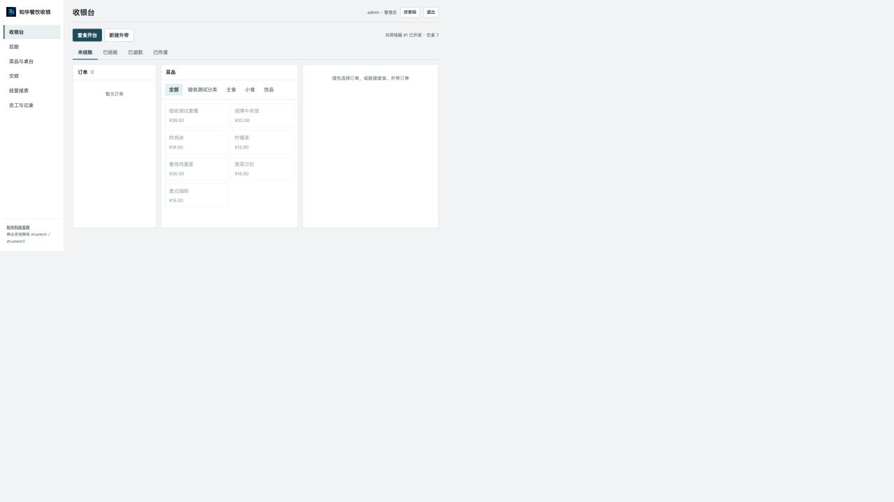
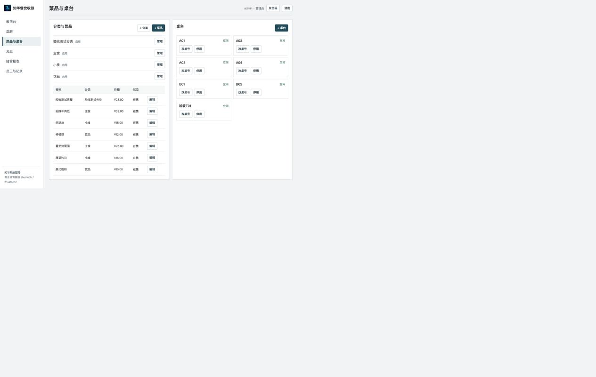
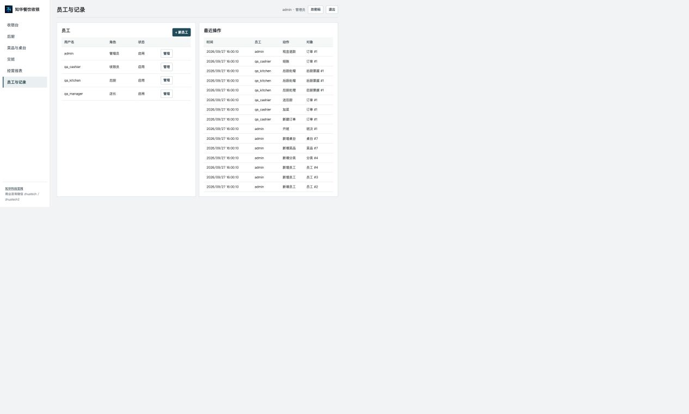
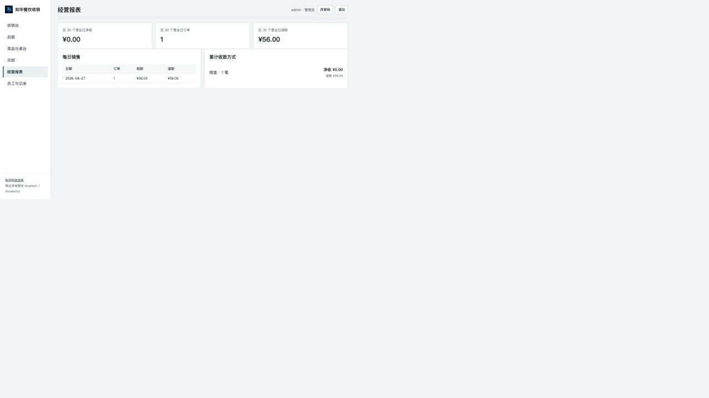
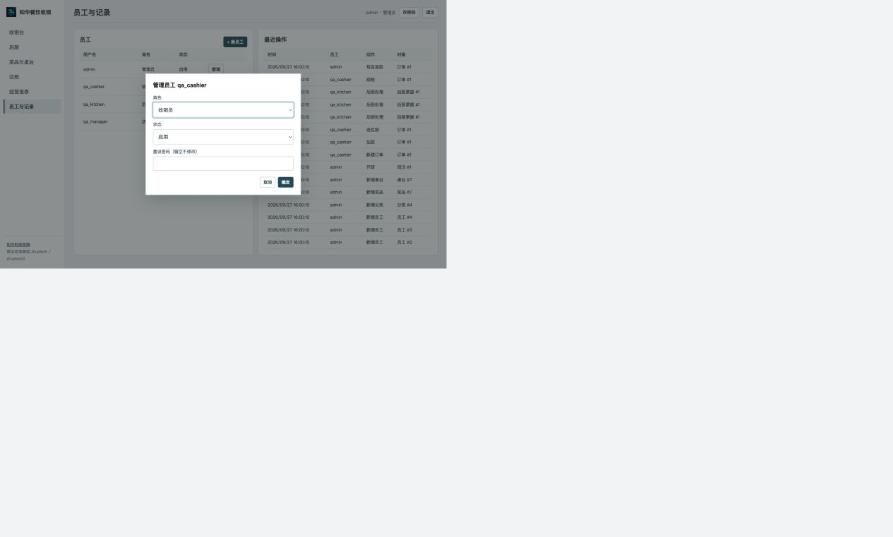

# 知华餐饮收银


知华科技（上海如静知华信息科技有限公司）提供的单门店餐饮收银源码。适用于小型堂食、外带门店在自有设备或局域网中完成开台、点单、后厨出单、现金收银、交班及营业查询。项目采用 Node.js 24 与 SQLite，不依赖外部云服务；首次启动需要自行设置管理员密码。


本项目由知华科技（上海如静知华信息科技有限公司）提供公开源码学习版本，主要用于个人学习、技术研究与非商业交流。未经书面授权不得商用。企业信息化建设、中小企业数字化转型、中小企业 AI 转型、私有化部署、软件外包、软件项目外包、软件实施、FDE 外包、OPC 技术支持及深度定制开发，请访问知华科技官网 https://www.zhuatech.cn/，或添加微信 zhuatech、zhuatech2 咨询。

## 在线试用

[进入知华餐饮收银试用](https://zhuatech-restaurant-pos-demo.zhh260417.chatgpt.site/) · [试用与交付说明](https://zhuatech-restaurant-pos-demo.zhh260417.chatgpt.site/guide.html)

选择管理员、店长、收银员或后厨即可体验点单、送厨、出餐、收款、交班和营业查询。每个浏览器使用独立演示门店，数据保留 24 小时，可手动重置；请使用虚构数据。在线演示不会发起真实支付，不同设备的演示数据不互通；独立部署版支持同一门店多设备共用数据。

当前试用站在国内访问可能需要 VPN；将源码部署到国内可访问的服务器后，不受这个试用地址的访问条件限制。

## 已实现的门店流程

| 环节 | 当前能力 |
| --- | --- |
| 菜品与桌台 | 分类增改与停用、菜品增改与上下架、桌台增改与停用；订单保留点单时的菜名和单价 |
| 堂食与外带 | 开台/外带、换桌、加菜、未送厨菜品数量与备注更正、分批发送后厨、退菜通知、多菜拆单、折扣和作废；多收银页面自动更新，旧账单修改会被拒绝并提示重新核对 |
| 后厨 | 新单和退菜票据、制作中、待出餐、完成状态 |
| 收银 | 现金收款与找零、外部支付终端**已收款的人工登记**、防重复收款标识、小票浏览器打印；现金订单全额退款和外部终端**已退款的人工登记** |
| 营业管理 | 员工账号与角色、自助修改密码、单店共用钱箱班次、备用金与营业中现金收支、交班时核对跨班未结订单、差额及历史、收退款操作人、销售报表、操作记录、SQLite 备份 |

外部终端收款和退款均须先在独立终端完成，再填写对应交易号。系统**不会向微信支付、支付宝或银行卡发起交易，也不会自动验证到账或退款**。当前版本没有离线多设备同步、扫码自助点餐、会员、库存配方、采购、外卖平台、发票、钱箱/客显/专用打印机驱动。上述能力的关联关系和接入条件见[系统边界与集成](docs/ARCHITECTURE.md)。这些模块需要门店流程、设备型号及服务商接口权限明确后实施。

## 本地运行

要求 Node.js **24.19.0 或更高版本**；项目没有第三方 npm 依赖。

```bash
cd zhuatech-restaurant-pos
export POS_ADMIN_PASSWORD='请在这里设置不少于12位的独立密码'
export POS_DEMO_DATA=true
npm start
```

浏览器打开 `http://127.0.0.1:8091`，用户名 `admin`，密码为上面设置的值。演示数据仅首次创建空数据库时写入。正式门店使用时不要设置 `POS_DEMO_DATA=true`；在“菜品与桌台”录入门店数据，在“员工与记录”分配账号。收款前由一人到“交班”开启共用钱箱，其他收银员即可在同一钱箱收款；开班人或店长负责清点交班。当前一个数据库只管理一个钱箱；有多个实体钱箱的门店需要分别部署或定制多钱箱支持。页面适合电脑和平板；手机可以查看后厨任务。

也可使用 Docker Compose：

```bash
export POS_ADMIN_PASSWORD='请在这里设置不少于12位的独立密码'
docker compose up --build -d
```

Compose 默认仅映射到本机 `127.0.0.1:8091`，数据保存到 Docker 卷。需要局域网访问时应由部署人员配置受信任的反向代理、HTTPS、网络访问控制，并设置 `POS_SECURE_COOKIE=true`；不要直接暴露到公网。环境变量名称见[`.env.example`](.env.example)。已有数据库不会因为环境变量变更而重设管理员密码，请在系统内修改员工密码。

## 界面


[后厨](docs/screenshots/kitchen.jpg) · [菜品与桌台](docs/screenshots/menu.jpg) · [共用钱箱](docs/screenshots/shift.jpg) · [交班确认](docs/screenshots/shift-confirm.jpg) · [手机交班确认](docs/screenshots/shift-confirm-mobile.jpg) · [经营报表](docs/screenshots/report.jpg) · [小票](docs/screenshots/receipt.jpg)

以下实录来自独立部署和虚构验收数据；没有模拟的后台或权限页面。

| 登录 | 用户工作台 |
| --- | --- |
|  |  |

| 核心配置 | 后台账号管理 |
| --- | --- |
|  |  |

| 经营统计 | 账号角色设置 |
| --- | --- |
|  |  |

## 操作与验证

- [门店操作手册](docs/OPERATIONS.md)
- [系统边界与集成](docs/ARCHITECTURE.md)
- [交付验收清单](docs/ACCEPTANCE.md)
- `npm run lint`：检查 JavaScript 语法
- `npm test`：业务和接口测试
- `npm run build`：生成 `dist/` 交付目录
- `POS_DB_PATH=./data/pos.sqlite npm run backup -- ./backup-20260925.sqlite`：创建并验证一致性备份

备份文件含门店交易及员工数据，不应提交到源码仓库。恢复前停止服务，保留原数据库与相关 WAL 文件的副本，再将已验证备份放回配置的数据库路径，并定期在门店部署环境演练恢复。升级前先备份；若旧版有多个未交班的个人班次，须先在旧版分别清点交班，再升级为共用钱箱。[完整操作说明](docs/OPERATIONS.md#备份与恢复)。

## 授权

本仓库源码供评估和非商业试用；商业门店使用、再销售、客户交付或源码再授权须另行取得知华科技书面商业授权。详见[LICENSE](LICENSE)。品牌与联系方式不改变第三方组件的许可条件。

## 工程、账号与部署参数

`src/db.js` 管理 SQLite 建表和版本迁移，`src/pos.js` 实现门店业务事务，`src/server.js` 提供认证和权限接口，`web/` 为工作台，`scripts/` 提供备份与交付构建，`tests/` 提供业务和接口回归，`deploy/nginx.conf` 为同源代理。Nginx → Node.js 24.19+ → SQLite，持久化到 `pos_data` 卷。镜像打包前运行语法检查、全部测试和交付构建，失败即终止。

员工通过门店登录页使用业务工作台；后厨账号只能处理后厨任务，店长与管理员拥有相应营业和配置权限，员工管理限管理员。角色固定为管理员、店长、收银员、后厨，不支持自定义角色、组织或租户。密码采用随机盐 scrypt，非 BCrypt。当前并非默认 Java/MySQL 技术栈的通用企业管理平台。

初始化管理员为 `admin`，密码通过 `POS_ADMIN_PASSWORD` 设置，没有共享默认密码。正式数据从空门店录入；仅在空库首次初始化且 `POS_DEMO_DATA=true` 时加入虚构菜品和桌台。环境变量完整名称见 [.env.example](.env.example)。`POS_HOST`、`POS_PORT`、`POS_DB_PATH` 控制直接运行的服务；Compose 的外部入口使用 `POS_BIND_ADDRESS`、`POS_PUBLIC_PORT`，服务内部固定 8091。

```sh
# 使用不同的本机入口端口，避免与其他门店部署冲突
POS_PUBLIC_PORT=18191 docker compose up --build -d
```

入口默认 `http://127.0.0.1:8091/`，健康检查 `/health`。Compose 网关等待收银服务健康。HTTPS 在受信任的外层代理终止，配置后应设置安全 Cookie，并按部署环境演练登录、打印、备份和退款流程。更改初始密码环境变量不会修改已存在账号的密码。

## 升级与故障处理

数据库结构通过 `src/db.js` 的 `PRAGMA user_version` 按 1—5 版顺序升级，不使用 Flyway。升级前先执行一致性备份，停止服务，保留原数据库和 WAL；升级后核对用户、菜品、桌台、历史订单和班次。不得让旧版程序访问较新数据库。升级共用钱箱前必须在旧版关闭多个未结班次。恢复和版本边界详见[操作手册](docs/OPERATIONS.md)。

端口占用时覆盖 `POS_PUBLIC_PORT`；无法收款时先核对是否开班、现金是否足够、订单是否被其他设备更新；403 时重新登录并检查员工角色，不能放宽后台权限。打印失败时核对浏览器打印设置和实际打印机，不宣称已适配专用硬件驱动。此版本没有可编辑权限矩阵、组织、多店、库存、支付自动到账或会员系统。

## 安全与反馈

会话和变更接口校验身份与 CSRF；密码和门店备份不得提交到仓库。提供本机默认监听及 Nginx 代理不等于完成公网生产运维。贡献见 [CONTRIBUTING.md](CONTRIBUTING.md)，一般问题请提交脱敏复现步骤，漏洞按 [SECURITY.md](SECURITY.md) 私下反馈。软件按现状提供，门店上线须按实际设备、支付与经营流程验收；外部终端人工登记不保证真实到账。

发布资料检查：`node scripts/verify-release.mjs`。此检查核对图片、原二维码、授权与示例配置；业务和部署仍须执行上文的实际验收。

## 联系知华科技

- 官网：https://www.zhuatech.cn/
- 商业授权、定制开发、私有部署及系统集成咨询微信：`zhuatech`、`zhuatech2`

| 微信 zhuatech | 微信 zhuatech2 |
| :---: | :---: |
|  |  |
