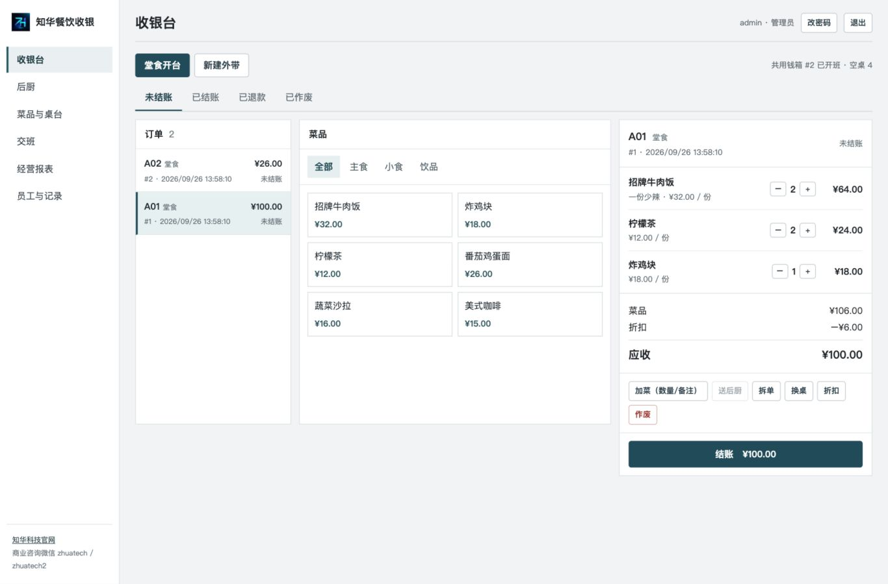

# 知华餐饮收银


知华科技（上海如静知华信息科技有限公司）提供的单门店餐饮收银源码。适用于小型堂食、外带门店在自有设备或局域网中完成开台、点单、后厨出单、现金收银、交班及营业查询。项目采用 Node.js 24 与 SQLite，不依赖外部云服务；首次启动需要自行设置管理员密码。

## 已实现的门店流程

| 环节 | 当前能力 |
| --- | --- |
| 菜品与桌台 | 分类增改与停用、菜品增改与上下架、桌台增改与停用；订单保留点单时的菜名和单价 |
| 堂食与外带 | 开台/外带、换桌、加菜、未送厨菜品数量与备注更正、分批发送后厨、退菜通知、多菜拆单、折扣和作废；多收银页面自动更新，旧账单修改会被拒绝并提示重新核对 |
| 后厨 | 新单和退菜票据、制作中、待出餐、完成状态 |
| 收银 | 现金收款与找零、外部支付终端**已收款的人工登记**、防重复收款标识、小票浏览器打印；现金订单全额退款和外部终端**已退款的人工登记** |
| 营业管理 | 员工账号与角色、自助修改密码、单店共用钱箱班次、备用金与营业中现金收支、交班时核对跨班未结订单、差额及历史、收退款操作人、销售报表、操作记录、SQLite 备份 |

外部终端收款和退款均须先在独立终端完成，再填写对应交易号。系统**不会向微信支付、支付宝或银行卡发起交易，也不会自动验证到账或退款**。当前版本没有离线多设备同步、扫码自助点餐、会员、库存配方、采购、外卖平台、发票、钱箱/客显/专用打印机驱动。上述能力的关联关系和接入条件见[系统边界与集成](docs/ARCHITECTURE.md)。这些模块需要门店流程、设备型号及服务商接口权限明确后实施。

## 本地运行

要求 Node.js **24.19.0 或更高版本**；项目没有第三方 npm 依赖。

```bash
cd zhuatech-restaurant-pos
export POS_ADMIN_PASSWORD='请在这里设置不少于12位的独立密码'
export POS_DEMO_DATA=true
npm start
```

浏览器打开 `http://127.0.0.1:8091`，用户名 `admin`，密码为上面设置的值。演示数据仅首次创建空数据库时写入。正式门店使用时不要设置 `POS_DEMO_DATA=true`；在“菜品与桌台”录入门店数据，在“员工与记录”分配账号。收款前由一人到“交班”开启共用钱箱，其他收银员即可在同一钱箱收款；开班人或店长负责清点交班。当前一个数据库只管理一个钱箱；有多个实体钱箱的门店需要分别部署或定制多钱箱支持。页面适合电脑和平板；手机可以查看后厨任务。

也可使用 Docker Compose：

```bash
export POS_ADMIN_PASSWORD='请在这里设置不少于12位的独立密码'
docker compose up --build -d
```

Compose 默认仅映射到本机 `127.0.0.1:8091`，数据保存到 Docker 卷。需要局域网访问时应由部署人员配置受信任的反向代理、HTTPS、网络访问控制，并设置 `POS_SECURE_COOKIE=true`；不要直接暴露到公网。环境变量名称见[`.env.example`](.env.example)。已有数据库不会因为环境变量变更而重设管理员密码，请在系统内修改员工密码。

## 界面



[后厨](docs/screenshots/kitchen.jpg) · [菜品与桌台](docs/screenshots/menu.jpg) · [共用钱箱](docs/screenshots/shift.jpg) · [交班确认](docs/screenshots/shift-confirm.jpg) · [手机交班确认](docs/screenshots/shift-confirm-mobile.jpg) · [经营报表](docs/screenshots/report.jpg) · [小票](docs/screenshots/receipt.jpg)

## 操作与验证

- [门店操作手册](docs/OPERATIONS.md)
- [系统边界与集成](docs/ARCHITECTURE.md)
- [交付验收清单](docs/ACCEPTANCE.md)
- `npm run lint`：检查 JavaScript 语法
- `npm test`：业务和接口测试
- `npm run build`：生成 `dist/` 交付目录
- `POS_DB_PATH=./data/pos.sqlite npm run backup -- ./backup-20260925.sqlite`：创建并验证一致性备份

备份文件含门店交易及员工数据，不应提交到源码仓库。恢复前停止服务，保留原数据库与相关 WAL 文件的副本，再将已验证备份放回配置的数据库路径，并定期在门店部署环境演练恢复。升级前先备份；若旧版有多个未交班的个人班次，须先在旧版分别清点交班，再升级为共用钱箱。[完整操作说明](docs/OPERATIONS.md#备份与恢复)。

## 授权

本仓库源码供评估和非商业试用；商业门店使用、再销售、客户交付或源码再授权须另行取得知华科技书面商业授权。详见[LICENSE](LICENSE)。品牌与联系方式不改变第三方组件的许可条件。

## 联系知华科技

- 官网：https://www.zhuatech.cn/
- 商业授权、定制开发、私有部署及系统集成咨询微信：`zhuatech`、`zhuatech2`

 
